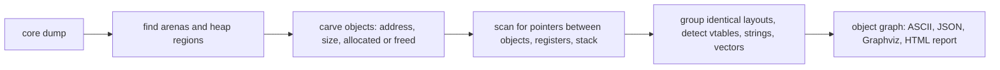

<div align="center">

# naksheap / नक्षीप

**Reconstruct the heap from a core dump.** Point it at a crash dump of a stripped, optimized C++ binary and it recovers the live heap objects, their sizes and states, the pointers between them, and probable struct layouts, all without debug info and without a debugger.

</div>

## Why

A stripped `-O2` binary crashes. The stack is garbage, gdb has no symbols, and nobody can tell you what the heap held at the moment of death. That is usually where the evidence lives.

The tools you already have stop at the wrong layer. Volatility works on the operating system, pwndbg needs a live process, Valgrind needs to re-run the program, and ASan needs the source rebuilt. None of them read a dead core dump and answer the real question: which objects were alive, and who pointed at what.

naksheap reads the allocator metadata that is already in the dump. It walks glibc's chunk headers, decodes the tcache and fastbin free lists, finds large mmap-served allocations, discovers main and thread arenas, and builds a reference graph of everything it recovers. Every object gets a label with a confidence score and the evidence behind it, not a bare guess.

## What it does

The pipeline is one command, end to end.



## Quick start

```bash
cargo build --release
./target/release/naksheap self-test        # smoke test on a synthetic fixture
./target/release/naksheap graph dump.core   # analyze a real core dump
./target/release/naksheap graph dump.core --html --out report
```

Open `report/report.html` in a browser to browse the object graph. Or use `--json` for the machine-readable version.

Generate a demo fixture if you do not have a core handy:

```bash
cargo run -p naksheap-testkit --example gen_fixture -- /tmp/fixtures
./target/release/naksheap graph /tmp/fixtures/toy-server.core
```

## CLI

| Command | What it prints |
|---|---|
| `info` | file format, process, pointer width, memory map |
| `maps` | the memory map, one range per line |
| `heap` | carved objects: address, size, state, arena |
| `graph` | the object graph. Default is an ASCII tree; add `--json`, `--dot`, or `--html` to export |
| `self-test` | run the whole pipeline on a synthetic fixture |

`graph` accepts `--max-depth`, and `--out` writes files into a directory instead of stdout. Piping to `head` is fine; a truncated core prints a warning instead of failing silently.

## Output

The graph lists objects and their relationships. This is real output from a real crash core, with the source object noted:

```text
0xf742c8000b70
└── likely std::vector [conf 0.80, n=2] [root]
    ├── +0x00 pointer begin -> 0xf742c8000c90
    ├── +0x08 pointer end -> 0xf742c8000ca8
    ├── +0x10 pointer capacity -> 0xf742c8000cb0
    └── 0xf742c8000c90
        └── opaque buffer [conf 0.45, n=1]
            ├── +0x00 pointer -> 0xf742c8000b90
            └── 0xf742c8000b90
                └── vtable object [conf 0.95, n=4]
                    ├── +0x00 vtable -> 0xbab435e1fbb0 in test
```

Each node carries its label, a confidence between 0 and 1, and evidence lines in the JSON export. Reachability from the registers and stack is computed, so objects with no live references are listed separately as unreachable.

## Supported inputs

| Input | Status |
|---|---|
| ELF core dumps, x86-64 | primary; validated on synthetic fixtures, real-core runs pending |
| ELF core dumps, aarch64 | works, validated against real cores |
| Windows minidumps | memory list only, 64-bit, no threads or registers |
| 32-bit, macOS cores, /proc/kcore, QEMU snapshots | not supported |

The allocator parser targets glibc ptmalloc on 64-bit. jemalloc and tcmalloc heaps are not parsed.

## Validation

The pipeline is tested on two layers.

Synthetic fixtures with a ground-truth manifest cover the carve, scan, inference, and export stages, and regenerate byte-for-byte.

Real core dumps come from `scripts/real-dump-test.sh`. It runs real C++ programs in a Linux container, crashes them, and snapshots them with gcore. It then checks that every address the program printed appears in the recovered graph at the same address. The checked-in results are aarch64 Ubuntu 24.04 with glibc 2.39. That testing is what exposed the glibc quirks the tool handles: tcache and fastbin frees do not clear the chunk PREV_INUSE bit, so freed chunks are found by cross-referencing the free lists, and large mmap allocations are recovered from their own chunk headers.

## Limitations

| Limitation | Detail |
|---|---|
| Inference is heuristic | Type labels are hypotheses with confidence and evidence, never certainty. Addresses, sizes, and allocator state are the reliable part. |
| Zombie memory | Freed chunks stay physically present until reused. They are flagged as freed, not silently dropped. |
| Large bin lists | Unsorted, small, and large bins are not walked yet. Fastbin and tcache free lists are. |
| No live debugging | This reads a static snapshot. It cannot groom a live heap or predict the next allocation. |

## Web

Two ways to run this in a browser, and they are not equivalent.

**In the browser, nothing is uploaded.** `crates/naksheap-wasm` compiles the
pipeline to WebAssembly. The page reads the dump from a file input, analyzes it
in a Web Worker, and renders the graph. The bytes never leave the machine, and
the page makes no third-party request of any kind.

- Frontend: <https://naksheap.lverma.com>
- Source: `web/`, deployed by Vercel from this repository on every push to
  `main`.

A `wasm32` guest can address 4 GiB of linear memory and the pipeline needs
several times the input size, so the in-browser build caps uploads at 256 MiB
and points at the service for anything larger. Larger dumps, and CI, use the
service:

- API: `naksheap-api.lverma.com`, `PUT /analyze` with the raw dump as the body.

```bash
curl -s -X PUT --data-binary @core.dump \
     -H 'Content-Type: application/octet-stream' \
     https://naksheap-api.lverma.com/analyze
```

The service keeps the report and the graph, then deletes the raw core. See
`deployment.md` for the service configuration and `web/README.md` for the
frontend build.

## Privacy

Analysis is fully offline. The HTML report is a single self-contained file: the graph data and the renderer are both embedded, so opening a report makes no network request of any kind. There is no CDN, no external font, no analytics.

Dumps can contain credentials and keys, so the browser build is the default and the safer one: nothing is uploaded. The service at `naksheap-api.lverma.com` does receive the file, holds the report for 24 hours, and deletes the raw core as soon as the analysis finishes.

## License

MIT OR Apache-2.0
